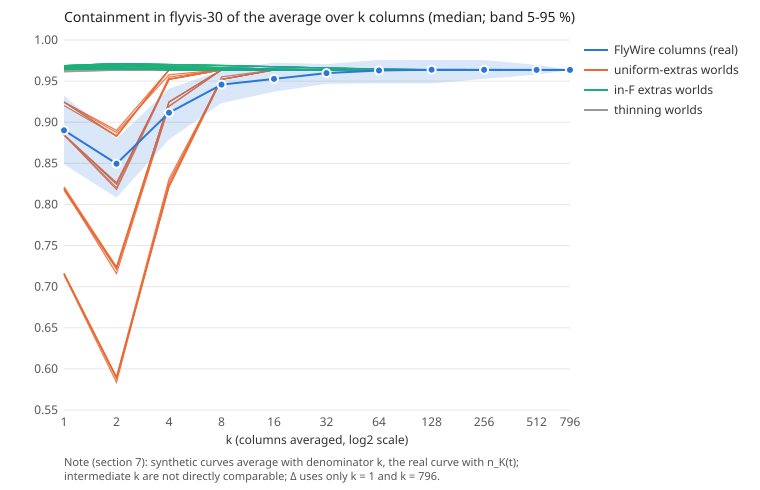

# The column test: a lower bound on how much agreement our processing produces

Registration: `docs/plans/2026-09-24-column-test-registration.md`, revision 2.3. git_head=b3f41ed36eb0131a644c89f9ef7ac16b578ca18a, runtime=4.8s.

Not a proxy for the overlap between banks (section 0). A lower bound on the FlyWire side only.

**Verdict: unclear.** Δ = +0.07346, L = +0.00000, k* = 9.30 %, k*_obs = 17.28 % (diagnostic), k*_F = < 0 % (read only under (c)); median |E_c \ B| = 34, median |B \ E_c| = 27 (over the 796 columns).

Beside it (decides nothing): Δ_294 = +0.07870, label unclear, k* = 9.96 %.

## Reference numbers (section 3.1)

| name | value | as registered |
|---|---|---|
| `R_in` | 0.9636 | 159/165 = 0.9636 (the 96.4 %) |
| `R_cov` | 0.6974 | 159/228 = 0.6974 |
| `R_jac` | 0.6795 | 159/234 = 0.6795 |
| `chance` | 0.2533 | 228/900 = 0.2533 |

## Synthetic calibration (section 3.8)

| family | rate | extra pairs, share of \|B\| | Δ_cal (median of 5) | the 5 worlds |
|---|---|---|---|---|
| uniform extras | r = 0 % | 0 % | +0.00000 | defined as 0, no world |
| uniform extras | r = 5 % | 5 % | +0.03922 | +0.04341, +0.03922, +0.03922, +0.03922, +0.03922 |
| uniform extras | r = 10 % | 10 % | +0.07902 | +0.07902, +0.07902, +0.07902, +0.07902, +0.07902 |
| uniform extras | r = 20 % | 20 % | +0.14454 | +0.14454, +0.14638, +0.14364, +0.14454, +0.14221 |
| uniform extras | r = 40 % | 40 % | +0.24812 | +0.24748, +0.24844, +0.24905, +0.24753, +0.24812 |
| in-F extras | q_F = 0 % | 0.0 % | +0.00000 | defined as 0, no world |
| in-F extras | q_F = 5 % | 2.1 % | -0.00065 | -0.00065, -0.00065, -0.00065, -0.00065, -0.00065 |
| in-F extras | q_F = 10 % | 4.2 % | -0.00148 | -0.00148, -0.00148, -0.00148, -0.00148, -0.00148 |
| in-F extras | q_F = 20 % | 8.4 % | -0.00284 | -0.00284, -0.00284, -0.00284, -0.00284, -0.00284 |
| in-F extras | q_F = 30 % | 12.5 % | -0.00411 | -0.00411, -0.00393, -0.00411, -0.00393, -0.00411 |
| in-F extras | q_F = 40 % | 16.7 % | -0.00511 | -0.00528, -0.00528, -0.00511, -0.00511, -0.00511 |

L = minimum Δ over the 48 thinning worlds = +0.00000.

| p | Δ of the 6 thinning worlds (validation, then calibration) | Q3/P95 labels |
|---|---|---|
| 0.05 % | +0.00000, +0.00000, +0.00000, +0.00000, +0.00000, +0.00000 | (a), (a), (a), (a), (a), (a) |
| 0.1 % | +0.00000, +0.00000, +0.00000, +0.00000, +0.00000, +0.00000 | (a), (a), (a), (a), (a), (a) |
| 0.2 % | +0.00000, +0.00000, +0.00000, +0.00000, +0.00000, +0.00000 | (a), (a), (a), (a), (a), (a) |
| 0.5 % | +0.00022, +0.00022, +0.00022, +0.00022, +0.00022, +0.00022 | (a), (a), (a), (a), (a), (a) |
| 1 % | +0.00022, +0.00022, +0.00022, +0.00022, +0.00022, +0.00022 | (a), (a), (a), (a), (a), unclear |
| 2 % | +0.00067, +0.00067, +0.00067, +0.00067, +0.00067, +0.00067 | unclear, unclear, unclear, unclear, unclear, unclear |
| 5 % | +0.00137, +0.00137, +0.00161, +0.00161, +0.00161, +0.00161 | (a), (a), (a), (a), (a), (a) |
| 10 % | +0.00260, +0.00235, +0.00210, +0.00235, +0.00210, +0.00260 | (a), (a), (a), (a), (a), (a) |

Two-world check:

| world | seed | Δ | label | requirement | result |
|---|---|---|---|---|---|
| thinning 0.05 % | 100 | +0.00000 | (a) | must read (a) | pass |
| thinning 0.1 % | 101 | +0.00000 | (a) | must read (a) | pass |
| thinning 0.2 % | 102 | +0.00000 | (a) | must read (a) | pass |
| thinning 0.5 % | 103 | +0.00022 | (a) | must read (a) | pass |
| thinning 1 % | 104 | +0.00022 | (a) | must read (a) | pass |
| thinning 2 % | 105 | +0.00067 | (a) | must read (a) | pass |
| thinning 5 % | 106 | +0.00137 | (a) | must read (a) | pass |
| thinning 10 % | 107 | +0.00260 | (a) | must read (a) | pass |
| uniform 5 % | 305 | +0.03922 | (a) | must not read (b) | pass |
| uniform 10 % | 310 | +0.07902 | unclear | must read unclear | pass |
| uniform 20 % | 320 | +0.14545 | (b) | must not read (a) | pass |
| uniform 30 % | 330 | +0.20108 | (b) | must read (b) | pass |
| uniform 40 % | 340 | +0.25059 | (b) | must read (b) | pass |
| in_F 30 % | 530 | -0.00411 | (c) | must read (c) | pass |
| in_F 40 % | 540 | -0.00528 | (c) | must read (c) | pass |

## The real curve (section 3.2)

| k | samples | empty | C p5 | p25 | p50 | p75 | p95 | mean | chance-corr. p50 | \|A_K\| p50 |
|---|---|---|---|---|---|---|---|---|---|---|
| 1 | 796 | 0 | 0.8489 | 0.8737 | 0.8902 | 0.9075 | 0.9322 | 0.8906 | 0.8529 | 173 |
| 2 | 50 | 0 | 0.8082 | 0.8305 | 0.8495 | 0.8640 | 0.8799 | 0.8464 | 0.7984 | 208.5 |
| 4 | 50 | 0 | 0.8790 | 0.8989 | 0.9116 | 0.9273 | 0.9408 | 0.9116 | 0.8816 | 185 |
| 8 | 50 | 0 | 0.9232 | 0.9370 | 0.9458 | 0.9521 | 0.9630 | 0.9439 | 0.9274 | 173.5 |
| 16 | 50 | 0 | 0.9371 | 0.9476 | 0.9527 | 0.9635 | 0.9724 | 0.9554 | 0.9366 | 168 |
| 32 | 50 | 0 | 0.9467 | 0.9537 | 0.9598 | 0.9690 | 0.9707 | 0.9607 | 0.9461 | 167 |
| 64 | 50 | 0 | 0.9472 | 0.9571 | 0.9630 | 0.9699 | 0.9759 | 0.9622 | 0.9504 | 168 |
| 128 | 50 | 0 | 0.9472 | 0.9576 | 0.9639 | 0.9695 | 0.9756 | 0.9627 | 0.9516 | 166.5 |
| 256 | 50 | 0 | 0.9528 | 0.9581 | 0.9637 | 0.9697 | 0.9755 | 0.9637 | 0.9514 | 166 |
| 512 | 50 | 0 | 0.9578 | 0.9583 | 0.9636 | 0.9643 | 0.9697 | 0.9629 | 0.9513 | 166 |
| 796 | 1 | 0 | 0.9636 | 0.9636 | 0.9636 | 0.9636 | 0.9636 | 0.9636 | 0.9513 | 165 |



## Where single columns' extra pairs lie (section 3.9; decides nothing)

- **all_796** (796 columns; 0 with no non-B pair): X_c n = 796; min 0.2222, p5 0.4000, p25 0.4828, p50 0.5385, p75 0.5854, p95 0.6667, max 0.8571, mean 0.5351; |E_c \ B| n = 796; min 4.0, p5 13.0, p25 26.0, p50 34.0, p75 41.0, p95 50.0, max 62.0, mean 33.1; |B \ E_c| n = 796; min 6.0, p5 12.8, p25 20.0, p50 27.0, p75 40.0, p95 87.5, max 137.0, mean 34.5
- **included_294** (294 columns; 0 with no non-B pair): X_c n = 294; min 0.3404, p5 0.4286, p25 0.5000, p50 0.5455, p75 0.5833, p95 0.6504, max 0.7500, mean 0.5413; |E_c \ B| n = 294; min 14.0, p5 27.0, p25 33.0, p50 40.0, p75 45.0, p95 52.3, max 62.0, mean 39.4; |B \ E_c| n = 294; min 6.0, p5 10.0, p25 15.0, p50 19.0, p75 23.0, p95 31.3, max 42.0, mean 19.3

Reference points: uniform extras give 69/735 = 0.0939; in-F extras give 1.

## Inclusion (section 2.3)

`{"columns": 796, "complete_30_types": 306, "included_complete_and_interior": 294, "removed_lacking_a_type": 490, "removed_complete_but_not_interior": 12, "columns_with_at_least_28_types": 612, "columns_missing_type": {"C2": 53, "C3": 29, "L1": 7, "L2": 7, "L3": 59, "L4": 85, "L5": 18, "Mi1": 0, "Mi4": 32, "Mi9": 30, "R7": 137, "R8": 142, "T1": 61, "T2": 79, "T2a": 31, "T3": 67, "T4a": 68, "T4b": 53, "T4c": 18, "T4d": 46, "T5a": 61, "T5b": 52, "T5c": 57, "T5d": 92, "Tm1": 23, "Tm2": 30, "Tm20": 56, "Tm3": 53, "Tm4": 77, "Tm9": 43}}`

## S1: each included column inside flyvis-30 (section 3.3)

- C(E_c): n = 294; min 0.8135, p5 0.8492, p25 0.8708, p50 0.8849, p75 0.8985, p95 0.9216, max 0.9383, mean 0.8850; empty columns: 0
- chance-corrected: n = 294; min 0.7502, p5 0.7980, p25 0.8269, p50 0.8459, p75 0.8640, p95 0.8950, max 0.9173, mean 0.8460
- |E_c|: n = 294; min 146.0, p5 162.7, p25 176.0, p50 187.0, p75 194.0, p95 206.3, max 217.0, mean 185.1
- Q3/P95 label: (b) (share at or above R_in 0.0000 of 294); secondary, non-monotonic in the thinning rate (§3.7); decides nothing

## S2: included columns against each other (section 3.4)

- 43071 column pairs; with an empty set: 0
- overlap: n = 43071; min 0.7019, p5 0.7771, p25 0.8041, p50 0.8226, p75 0.8427, p95 0.8713, max 0.9477, mean 0.8236; chance-corrected: n = 43071; min 0.6359, p5 0.7183, p25 0.7516, p50 0.7747, p75 0.7993, p95 0.8351, max 0.9313, mean 0.7757; R_in = 0.9636
- Jaccard: n = 43071; min 0.5158, p5 0.6000, p25 0.6323, p50 0.6533, p75 0.6739, p95 0.7024, max 0.7807, mean 0.6527; chance-corrected: n = 43071; min 0.4606, p5 0.5502, p25 0.5853, p50 0.6088, p75 0.6312, p95 0.6632, max 0.7510, mean 0.6079; R_jac = 0.6795
- Q3/P95 labels: overlap vs R_in (b), Jaccard vs R_jac unclear; secondary, non-monotonic in the thinning rate (§3.7); decides nothing

## S3: single columns against their own averaged bank (section 3.5)

- |E_c ∩ B| / |E_c|: n = 294; min 0.7062, p5 0.7392, p25 0.7686, p50 0.7869, p75 0.8119, p95 0.8387, max 0.9085, mean 0.7888
- |E_c ∩ B| / |B|: n = 294; min 0.7455, p5 0.8100, p25 0.8606, p50 0.8848, p75 0.9091, p95 0.9394, max 0.9636, mean 0.8828

## S4: split-half averages (section 3.5; description only)

- **S4_294** (20 splits of 294 into halves of 147): overlap n = 20; min 0.9716, p5 0.9717, p25 0.9774, p50 0.9829, p75 0.9885, p95 0.9892, max 1.0000, mean 0.9827; Jaccard n = 20; min 0.9344, p5 0.9396, p25 0.9450, p50 0.9532, p75 0.9559, p95 0.9614, max 0.9667, mean 0.9517; C of each half (both pooled) n = 40; min 0.9382, p5 0.9435, p25 0.9492, p50 0.9494, p75 0.9545, p95 0.9609, max 0.9708, mean 0.9518
- **S4_796** (20 splits of 796 into halves of 398): overlap n = 20; min 0.9697, p5 0.9699, p25 0.9819, p50 0.9879, p75 0.9939, p95 0.9942, max 1.0000, mean 0.9864; Jaccard n = 20; min 0.9360, p5 0.9409, p25 0.9526, p50 0.9588, p75 0.9645, p95 0.9650, max 0.9704, mean 0.9570; C of each half (both pooled) n = 40; min 0.9524, p5 0.9573, p25 0.9581, p50 0.9635, p75 0.9643, p95 0.9703, max 0.9755, mean 0.9624

## Zcode's falsifier (section 3.2; no role in the verdict)

`{"reproduces_bank_rows_to_1e-12": false, "pairs": 175, "pairs_in_B": 164, "C": 0.9485714285714286, "note": "printed without any role in the verdict"}`

## Offset bins (section 2.4)

- `{"n_columns": 796, "rows_by_max_abs_offset": {"0": 96163, "1": 130036, "2": 16625, "3+": 2985}, "existences_by_smallest_bin": {"0": 96163, "1": 30704, "2": 2807, "3+": 554}}`
- `{"n_columns": 294, "rows_by_max_abs_offset": {"0": 41442, "1": 56290, "2": 6119, "3+": 872}, "existences_by_smallest_bin": {"0": 41442, "1": 12005, "2": 830, "3+": 143}}`

## Checks

- machine check (section 3.6): `{"passed": true, "rows": 393, "pairs": 165, "max_abs_diff": 0.0}`
- curve anchor (section 3.2): passed

## The registered reading (sections 4 and 5, quoted)

> ## 4. Reading rule (every branch named before data)
>
> The label is read from the primary statistic `Δ` (§3.2), against two calibrations of §3.8: the
> thinning lower envelope `L` (the minimum `Δ` over all 48 thinning worlds of §3.8, calibration and
> validation, nothing subtracted) and the uniform-extras calibration, on which `Δ` is located as the equivalent
> extra-pair rate `k*`. Under (c) its size is located on the in-F calibration as `k*_F` (printed
> under every label, and marked "(read only under (c))" under the others). On the registered grid
> `L` is 0, so **in practice (c) ⟺ `Δ < 0`**, that is `Δ ≤ −0.0002`, one discrete step (§3.8,
> "What `L` is in practice"). The cut
> points below are **fixed now, before any data**, and are not revised after the real curve is seen.
> The four branches are exhaustive and exclusive: (c) is tested first, and (a), unclear and (b) are
> read only when `Δ >= L`.
>
> | label | condition | reading |
> |---|---|---|
> | **(c) averaging removes agreement** | `Δ < L` | Single FlyWire columns sit closer to flyvis-30 than the averaged bank does: the median column's containment is above anything pure thinning produced. The FlyWire column mean (with its pruning) removes pairs that flyvis-30 has, and the 96.4 % **understates** the agreement on the FlyWire side. The averaging is not what produces the overlap. The size is printed as `k*_F`, the in-F extra-pair rate that gives the same fall; no cut is read from it. |
> | **(a) averaging adds little** | `Δ >= L` **and** `k* <= 5 %` (equivalently `L <= Δ <= Δ_cal(5 %)`) | Going from one column to the full average raises containment in flyvis-30 by no more than removing about one extra pair in twenty would, and does not lower it below what thinning alone gives. The 96.4 % is close to what one column already shows; the FlyWire column mean neither creates nor hides it. |
> | **unclear** | `Δ >= L` and `5 % < k* < 20 %` | The rise is larger than a small amount of per-column noise would give, but not large enough to call the 96.4 % a product of averaging. |
> | **(b) averaging manufactures agreement** | `Δ >= L` and `k* >= 20 %` (equivalently `Δ >= Δ_cal(20 %)`) | The rise from one column to the full average is as large as removing at least one extra pair in five from every column. The FlyWire column mean (with its pruning) lifts the agreement number well above what single columns show. |
>
> **Why these cuts.** B itself disagrees with flyvis-30 on 6 of its 165 pairs, 3.6 %. At `k* <= 5 %`
> the pairs averaging strips from a typical column are of the same order as that whole residual
> disagreement, and every thinning world, where averaging adds nothing by construction, must fall in
> this range (§3.8); so (a) is "indistinguishable, at this scale, from no averaging effect". At
> `k* >= 20 %` averaging strips from a typical column more than five times the bank's whole
> disagreement with flyvis-30: a single column then sits well below 96.4 % (about 0.82 by the
> back-of-envelope of §3.8), and the 96.4 % is mostly the average's work. Between the two the effect
> is real but of a size where "the average made it" and "the columns have it" both remain arguable,
> and it is named as such rather than rounded to one side. A narrower unclear band (for example
> 5 %-10 %) was considered and not taken: at 10 % a single column's containment is still about 0.88,
> which is not far enough below 0.96 to say that averaging *manufactures* the agreement.
>
> **Why the (c) floor is `L` and not 0 (revision 2.1).** Without a branch for a negative `Δ`, a fall
> would satisfy `k* <= 5 %` and be misread as (a). Pure thinning, where averaging does nothing, can
> itself put the median column a little above `R_in` (§3.8, `p` = 10 %), so 0 would call a thinning
> world (c). `L` is the most negative `Δ` that thinning produced on all 48 thinning worlds (§3.8),
> and a real `Δ` below it is a fall that thinning did not reach. No thinning world reads (c); this
> holds by the arithmetic of thinning, not because `L` is taken over 48 worlds (§3.8, "What `L` is in
> practice": `L` is 0, set by the worlds at `p` ≤ 0.2 %, and the 40-world minimum was also 0). `L` is
> taken as it is, with no margin subtracted: a margin would be a number chosen
> by eye, and the two-world check (§3.8) already requires in-F worlds at 30-40 % to fall below it and
> every thinning validation world to read (a). Measured by Ark: `L` lies in about [−0.0014, 0], and
> the in-F worlds at `q_F` = 30 % and 40 % (`Δ` = −0.0041, −0.0051) sit two to three times further
> below 0.
>
> **Known consequence:** `L` is expected at or a little below 0 (§3.8), and the in-F calibration spans
> only about 0.005, so (c) can be read from a fall of a few thousandths. `k*_F` is printed so that the
> size of a (c) reading is never hidden behind its label. No minimum `k*_F` is required for (c)
> (CC decision: no new cut). (c) is a direction label at a scale of thousandths; its practical
> consequence equals (a)'s; what the test is built to detect is (b). **A marginal (c) with a small
> `k*_F` is indistinguishable from a no-effect world crossing below `L` (about one run in fifty);
> read its direction, not an effect** (Zcode, revision 2.2; about 1.5 % of no-effect worlds at
> `p` = 10 % fall below zero).
>
> **Why this rule and not the Q3/P95 rule.** `Δ` compares the median single column with the full
> average, so dropping pairs (thinning) moves it by at most a few thousandths either way, whatever
> `p`, while sporadic extra pairs move it in one direction only, more as there are more: upward when
> they fall outside F, downward when they fall inside F; the reading is monotone in the effect it is
> meant to see. The Q3/P95 label of the first draft is not (§3.7); it is printed as a secondary label
> and decides nothing.
>
> **Chance.** Every point of the curve has the same chance level, 0.2533 (§3.3), so the rule reads
> the same on raw and chance-corrected values.
>
> **What decides.** The verdict is the label of `Δ`. The label of `Δ_294` (§3.3, read by the same four
> branches), the in-F share of extras (§3.9), the Q3/P95 labels of S1 and S2 (§3.7), and S2-S4 are
> printed beside it and decide nothing. If the label of `Δ_294` differs from the verdict,
> `RESULT.md` prints "the 796-column and 294-column readings disagree" beside the verdict. Whatever
> the label, `RESULT.md` and the script's `VERDICT:` log line print `Δ`, `L`, `k*` and `k*_F` as
> numbers next to it; when the label is not (c), `k*_F` is marked "(read only under (c))". Near zero
> `k*` is a step, not a dose (§3.8). If the label is (b), `RESULT.md` adds that the label rests on
> the definition of the threshold, not on a measured boundary (§3.8, "What the two-world check can
> and cannot falsify").
>
> **Two prints on the verdict line (Ark, revision 2.2; no new cut, they decide nothing).**
>
> - **Extras and losses.** The verdict line prints the median `|E_c \ B|` (extra pairs per column)
>   and the median `|B \ E_c|` (bank pairs a column lacks), over the 796 columns, beside the label.
>   The branch words ("strips", "removes") describe the case of extra pairs. To first order,
>   ```
>   Δ ≈ [(R_in − f_a) · a + (f_r − R_in) · r] / |B|
>   ```
>   with `a` the extra pairs of a column and `f_a` their in-F share, `r` the bank pairs it lacks
>   (here a count, not the rate `r` of §3.8) and `f_r` their in-F share. Random loss contributes
>   zero (`f_r = R_in`); loss of the six non-F pairs of B contributes negatively. A positive `Δ` can
>   therefore also come from losses concentrated inside F: if the columns mostly lack bank pairs
>   rather than carry extras, (b) can mean that averaging **restores missing pairs** rather than
>   strips extras. The two medians show which case the columns are in.
> - **`k*_obs`.** Printed next to `k*`: `k*_obs = Δ / (R_in − X)`, with `X` the median of `X_c`
>   over the 796 columns (§3.9): the first-order extra-pair rate for the columns' own in-F share of
>   extras. It is a diagnostic and decides nothing. It is printed as "n/a" (and stored as `null` in
>   `summary.json`) when `X` is undefined (no column has a pair outside B) or when `R_in − X` is
>   zero to rounding (Ark, revision 2.3). Its measured bounds on the uniform-extras worlds:
>   accurate at small `r` (`r` = 5 %: measured `Δ` +0.0392 against a first-order +0.0435), and it
>   underestimates the rate at large `r` (`r` = 40 %: measured `Δ` +0.2481 against a first-order
>   +0.3479). It is printed because `k*`
>   rests on an assumption: that a real column's extra pairs fall in F like uniform noise,
>   `f_a` = 69/735 = 0.094.
>
> ## 5. What each outcome means for question (ii)
>
> | label | what (ii)'s registration must do |
> |---|---|
> | **(a)** | (ii) may use the 96.4 % as its reference level without normalising for the FlyWire column mean. It must still state that flyvis's own column mean, the max merge and the hand edits are unmeasured (Part A: none can be separated with what flyvis ships). |
> | **(b)** | (ii) must normalise against averaging. Its registration names the normaliser before data: the S1 distribution (single included column inside flyvis-30) as the level expected with no averaging, and S4-294 (split-half of the same 294 columns inside flyvis-30) as the level averaging alone reaches within one fly; the curve (§3.2) is printed beside them. The 96.4 % is not to be read as between-brain agreement on its own. |
> | **unclear** | (ii) must report the 96.4 % only beside the curve and the S1 quantiles, never alone. Whether (ii) resumes, and with which normaliser, returns to Mike. |
> | **(c)** | (ii) may use the 96.4 % as its reference level without normalising for the FlyWire column mean, and must state that on the FlyWire side it is **conservative**: FlyWire averaging lowers agreement with flyvis-30, so it is not what produces the overlap. (ii) must print the S1 distribution beside the 96.4 % as the higher, single-column level, and `k*_F` with it. It must not claim that the 96.4 % understates between-brain agreement overall: flyvis's own column mean, the max merge and the hand edits remain unmeasured and may still inflate it from the flyvis side (§6). |
>
> Under every label the result is a **lower bound** on the arithmetic's share (§0), on the FlyWire
> side; under (c) that share is negative (the FlyWire arithmetic lowers the number). It is reported
> under the name of §0, never as "the overlap between banks".
